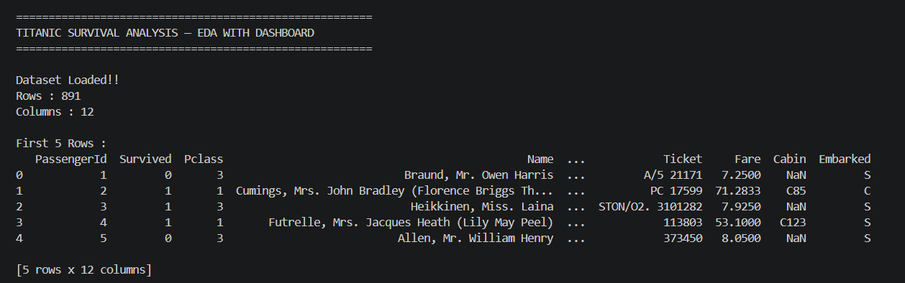
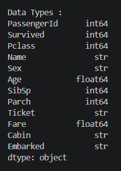
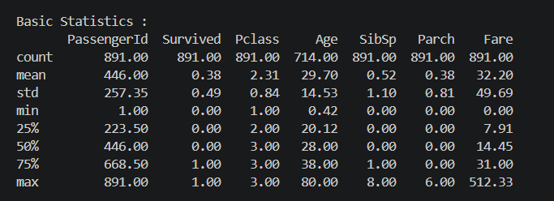
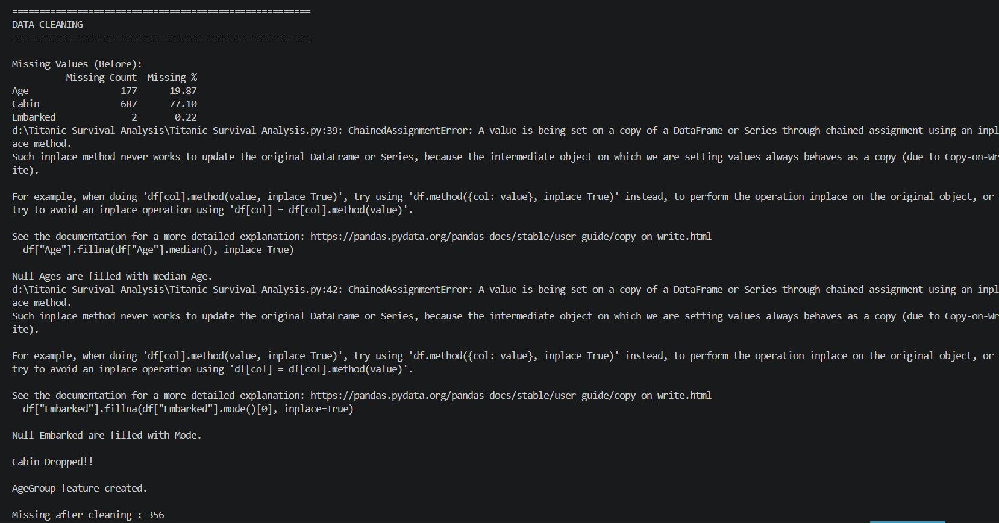
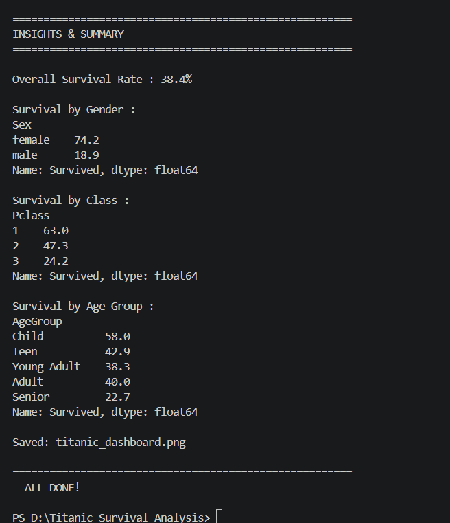
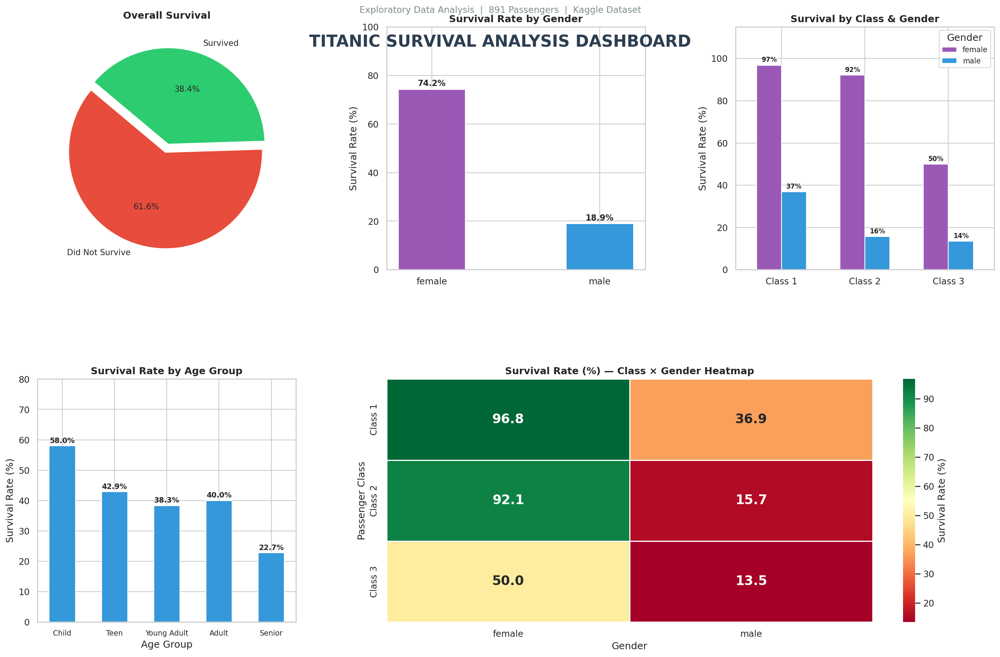

# 🚢 Titanic Survival Analysis — Exploratory Data Analysis (EDA)


> An end-to-end Exploratory Data Analysis project on the Titanic dataset to uncover key patterns behind passenger survival using Python, Pandas, Matplotlib, and Seaborn.

---

## 📌 Project Overview

The sinking of the RMS Titanic in 1912 is one of history's most infamous maritime disasters. This project performs a structured EDA to understand **which factors most influenced a passenger's chance of survival** — including gender, passenger class, and age group — and presents the findings through a comprehensive visual dashboard.

---

## 📁 Project Structure

```
Titanic Survival Analysis/
│
├── Titanic-Dataset.csv               # Raw dataset (Kaggle)
├── Titanic_Survival_Analysis.py      # Main EDA + Dashboard script
├── Titanic_Dashboard.png             # Final dashboard output
├── screenshots/                      # Terminal output screenshots
│   ├── 1_loading_overview.png
│   ├── 2_data_types.png
│   ├── 3_basic_statistics.png
│   ├── 4_data_cleaning.png
│   ├── 5_insights_summary.png
│   └── 6_dashboard.png
└── README.md
```

---

## 📊 Dataset Details

| Feature | Description |
|---|---|
| `PassengerId` | Unique ID for each passenger |
| `Survived` | 0 = Did not survive, 1 = Survived |
| `Pclass` | Ticket class (1 = 1st, 2 = 2nd, 3 = 3rd) |
| `Name` | Passenger name |
| `Sex` | Gender |
| `Age` | Age in years |
| `SibSp` | Siblings / spouses aboard |
| `Parch` | Parents / children aboard |
| `Ticket` | Ticket number |
| `Fare` | Passenger fare |
| `Cabin` | Cabin number |
| `Embarked` | Port of embarkation (C, Q, S) |

- **Total Records:** 891 passengers
- **Source:** [Kaggle Titanic Dataset](https://www.kaggle.com/competitions/titanic)

---

## ⚙️ Workflow & Output Screenshots

---

### 1. 📦 Loading & Overview

> Dataset is loaded and basic info like shape, first 5 rows, data types, and statistics are displayed.



---

### 2. 🔠 Data Types

> Column-wise data types are printed to understand the structure of each feature.



---

### 3. 📈 Basic Statistics

> Descriptive statistics like mean, std, min, max are shown for all numeric columns.



---

### 4. 🧹 Data Cleaning

> Missing values are identified, filled or dropped, and a new `AgeGroup` feature is engineered.



| Issue | Action |
|---|---|
| `Age` — 177 missing (19.87%) | Filled with **median age** |
| `Embarked` — 2 missing (0.22%) | Filled with **mode** |
| `Cabin` — 687 missing (77.10%) | **Dropped** column |
| New feature | Created `AgeGroup` (Child / Teen / Young Adult / Adult / Senior) |

---

### 5. 💡 Insights & Summary

> Key survival statistics by gender, class, and age group are printed to the terminal.



| Factor | Survival Rate |
|---|---|
| **Overall** | 38.4% |
| Female | 74.2% |
| Male | 18.9% |
| 1st Class | 63.0% |
| 2nd Class | 47.3% |
| 3rd Class | 24.2% |
| Children (0–12) | 58.0% |
| Seniors (60+) | 22.7% |

---

### 6. 📊 Dashboard — All Visualizations

> All 5 charts are rendered together in a single professional dashboard figure.



| Panel | Chart | Key Insight |
|---|---|---|
| 1 | 🥧 **Pie Chart** — Overall Survival | 61.6% did not survive vs 38.4% survived |
| 2 | 📊 **Bar Chart** — Survival by Gender | Females: 74.2% vs Males: 18.9% |
| 3 | 📊 **Grouped Bar** — Class × Gender | 1st Class females highest (96.8%) |
| 4 | 📊 **Bar Chart** — Survival by Age Group | Children had best odds at 58.0% |
| 5 | 🔥 **Heatmap** — Class × Gender | 3rd Class males lowest at 13.5% |

---

## 🔑 Key Findings

- **Gender** was the strongest predictor — being female dramatically improved survival odds
- **Class inequality** was clearly visible — 1st Class passengers had far better lifeboat access
- **Children** were prioritized during evacuation across all classes
- **Higher fare** (proxy for wealth/class) correlated positively with survival chances

---

## 🚀 How to Run

### Install dependencies
```bash
pip install pandas matplotlib seaborn
```

### Run the script
```bash
python Titanic_Survival_Analysis.py
```

The dashboard will be saved as `Titanic_Dashboard.png` in the same directory.

---

## 🛠️ Tools & Libraries

| Tool | Purpose |
|---|---|
| Python 3.10+ | Core programming language |
| Pandas | Data loading, cleaning, manipulation |
| Matplotlib | Base plotting & dashboard grid layout |
| Seaborn | Statistical heatmap visualization |

---

## 🧠 Skills Demonstrated

| Category | Skills |
|---|---|
| **Data Analysis** | EDA, Data Cleaning, Feature Engineering, Missing Value Treatment |
| **Visualization** | Pie Charts, Bar Charts, Grouped Bar, Heatmaps, Dashboard Layout |
| **Python** | Pandas, Matplotlib, Seaborn, GridSpec, Data Wrangling |
| **Soft Skills** | Data Storytelling, Insight Extraction, Clean Code, Documentation |

---

## 📂 Future Scope

- Build a **predictive ML model** (Logistic Regression / Random Forest) on top of this EDA
- Add **interactive visualizations** using Plotly or Dash
- Engineer new features: `FamilySize`, `Title` (from Name), `IsAlone`
- Perform **statistical hypothesis testing** on survival differences by gender and class

---

## 👨‍💻 Author

<div align="center">

**Rensee Gajipara**

[](https://github.com/RENSEE-GAJIPARA)

</div>

---

📌 **Data Analyst & Python Developer** — passionate about turning raw data into meaningful insights through clean code and compelling visualizations.

📌 **Developed this Titanic EDA Project** using Python, Pandas, Matplotlib, and Seaborn — covering the full pipeline from data cleaning and feature engineering to insight extraction and a professional 5-panel visual dashboard.

📌 **Focused on** structured EDA workflows, modular script design, and professional data storytelling for real-world datasets.

---

> ⭐ *If you found this project helpful, feel free to star the repository!*
